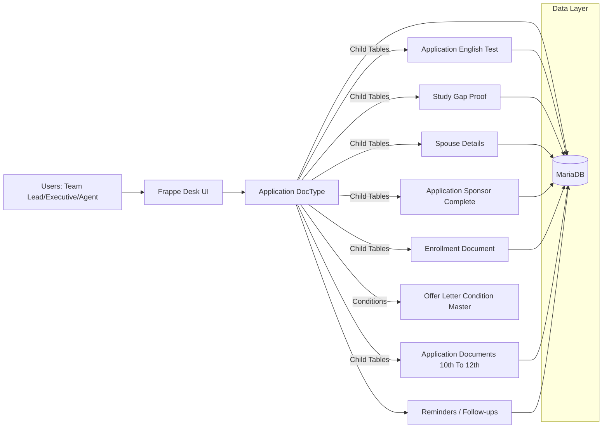

# Unideft — AI-Driven Visa Management CRM

**Unideft** is an **AI-ready, process-driven CRM** for overseas education and migration consultancies. Built on **Frappe / ERPNext**, it turns messy counselor workflows into one clear system: every student case lives as an **Application**, moves through defined stages, and stays fully auditable.

This repo is a **sanitized showcase** — architecture and patterns only. No secrets, no real client data.

---

## Screenshots


---

## What problem does it solve?

Education agents juggle students, documents, English tests, offers, finances, visas, and follow-ups — usually across sheets, chats, and memory.

Unideft gives them a **single source of truth**:
- one Application per case  
- stage-based progress (so nothing is skipped)  
- **context-aware forms** (only show what matters next)  
- structured evidence (not random file dumps)  
- reminders so deadlines don’t slip  

In short: **operational clarity + compliance-friendly traceability + data ready for analytics / AI**.

---

## Key Highlights

- **End-to-end case lifecycle** — From processing and financials through GS / acceptance, COE, file lodge, visa, and enrolment — all on one auditable Application.
- **Forensic-grade traceability** — Students, sponsors, conditions, refusals, gap proofs, and documents are linked and normalized, so you can reconstruct *what happened and why*.
- **Rule-based, smart forms** — Offer-letter conditions, English requirements, gap justification, interviews, spouse paths, and more appear only when relevant.
- **Evidence-first workflows** — Purpose-built tables + verification flags for ITR, salary slips, SOPs, offer letters, sponsor proofs, and English tests.
- **Analytics-ready by design** — Clean child tables and categorical statuses power dashboards, SLA tracking, cohort analysis, risk scoring, and future AI copilots.
- **Multi-country ready** — Destination-aware flows (e.g. Australia vs UK) with country-specific stages and rules on the same CRM backbone.

---

## Core Features (in plain English)

### 1. Stage-based visa operations
Counselors don’t guess the next step. The Application walks through tabs like **Processing → Financials → GS Processing → Acceptance → COE → File Lodged → Visa → Enrolled** (plus refusal / refund paths where needed).

### 2. Context-aware UI
Sections unlock based on answers — study gap type, interview timing, sponsor type, refusal handling, spouse pathways, and more. That reduces training time and **cuts operational variance** across teams.

### 3. Evidence-driven decisioning
Documents live in **structured child tables** with verification status — not a generic “uploads” folder. That supports audits, escalations, and defensible case history.

### 4. Follow-ups that don’t get lost
Deadlines and “No” answers can trigger **reminders** so counselors follow up on offers, deposits, interviews, and lodgements on time.

### 5. Built for scale & intelligence
Because data is normalized from day one, the same CRM becomes a foundation for:
- bottleneck / SLA analytics by stage  
- refusal & gap pattern analysis  
- destination / university cohort insights  
- future **AI assistance** (checklists, risk flags, draft follow-ups)

---

## Architecture Overview



**How to read this:** Users work in Frappe Desk → the Application is the hub → child tables store structured evidence → MariaDB is the system of record → reminders close the loop on follow-ups.

---

## Implementation Snippets

Small examples of how Unideft enforces quality and workflow in code.

### 1) Complex child tables open in a full modal (better data quality)

Source: `erpnext/crm/doctype/application/application.js`

```js
onload(frm) {
  // Force form view (modal) for child tables that should open in dialog on Add Row
  const form_view_tables = ["spouse_details_list", "table_ihmq"];
  form_view_tables.forEach((fieldname) => {
    const doctype = frm.meta.fields.find((df) => df.fieldname === fieldname && df.fieldtype === "Table")?.options;
    if (doctype) {
      frappe.model.with_doctype(doctype, () => {
        const meta = frappe.get_meta(doctype);
        if (meta) meta.editable_grid = 0;
      });
    }
  });
},

refresh(frm) {
  // Force Spouse Details and C. Sponsors tables to open in form/modal on Add Row
  ["spouse_details_list", "table_ihmq"].forEach((fieldname) => {
    const control = frm.fields_dict[fieldname];
    if (control && control.grid && !control.grid._form_view_patched) {
      control.grid.allow_on_grid_editing = function () {
        return false;
      };
      control.grid._form_view_patched = true;
    }
  });
}
```

### 2) Offer-letter conditions → dynamic Financials sections

Conditions are stored as **Table MultiSelect** rows. Matching sections (e.g. Interview) only render when selected.

Source: `erpnext/crm/doctype/application/application.json`

```js
// depends_on pattern used for conditional section rendering
eval:
doc.conditions_on_offer_letter
&& Array.isArray(doc.conditions_on_offer_letter)
&& doc.conditions_on_offer_letter.some(function(r){
  return (r.condition || '').indexOf('Interview') !== -1;
})
```

### 3) Purpose-built evidence tables (not generic attachments)

Source: `erpnext/crm/doctype/application_documents_10th_to_12th/application_documents_10th_to_12th.json`

```json
{
  "istable": 1,
  "fields": [
    {
      "fieldname": "document_type",
      "fieldtype": "Select",
      "label": "Document Type",
      "options": "\n12th Admit card\nschool domain email id\ndigilocker id/password"
    },
    {
      "depends_on": "eval:doc.document_type == 'school domain email id' || doc.document_type == 'digilocker id/password'",
      "fieldname": "write_details",
      "fieldtype": "Small Text",
      "label": "Write Details"
    },
    {
      "fieldname": "upload_document",
      "fieldtype": "Attach",
      "label": "Upload Document"
    }
  ]
}
```

---

## Tech Stack

| Layer | Choice |
|--------|--------|
| Platform | **Frappe / ERPNext** |
| Backend | **Python** |
| Frontend logic | **JavaScript** form scripts |
| Database | **MariaDB** |
| UX | Frappe Desk — DocTypes, tabs, child tables, conditional sections |

---

## Setup (high-level)

> Enough for reviewers to understand the stack. Production setups may differ.

```bash
cd /path/to/frappe-bench/apps
git clone https://github.com/<your-username>/unidef-erp.git

cd /path/to/frappe-bench
bench --site <site-name> install-app erpnext
bench migrate
bench clear-cache
bench restart
```

---

## Notes / Sanitization

- No API keys, tokens, or real student/client data in this showcase.
- Want a private demo walkthrough? Contact the author.
